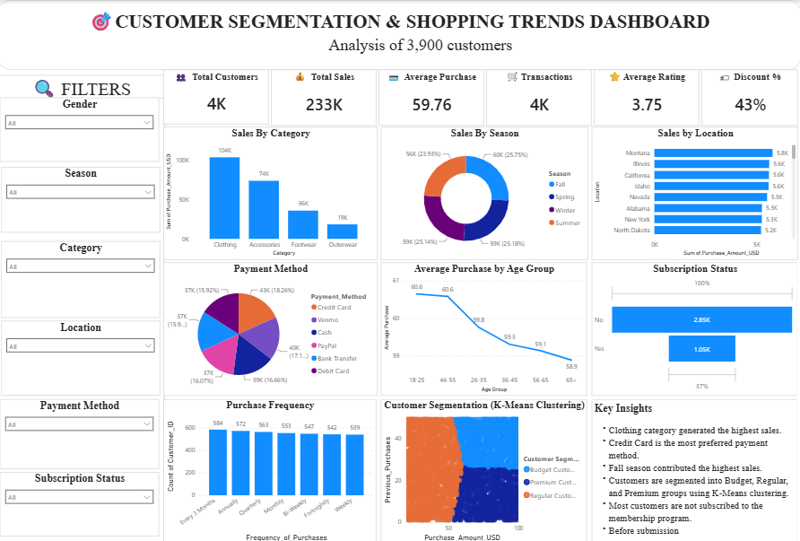

# Customer Segmentation Analysis

## 📌 Project Overview

This project focuses on analysing customer purchasing behaviour and segmenting customers into meaningful groups based on their spending patterns, purchase frequency, and other relevant characteristics.

The objective is to transform raw customer transaction data into actionable business insights that can support targeted marketing, customer retention, and business decision-making.

---

## 🎯 Objectives

- Analyse customer purchasing behaviour.
- Clean and preprocess the customer dataset.
- Perform Exploratory Data Analysis (EDA).
- Identify meaningful customer segments.
- Analyse customer spending and purchasing patterns.
- Develop an interactive dashboard to communicate insights.
- Provide business recommendations based on customer segments.

---

## 📂 Dataset

The dataset contains customer-related and transaction-related information used to understand purchasing behaviour.

Key areas analysed include:

- Customer demographics
- Purchase behaviour
- Spending patterns
- Purchase frequency
- Customer segments

---

## 🧹 Data Cleaning & Preprocessing

The following data preparation activities were performed:

- Checked for missing values.
- Identified and handled duplicate records.
- Reviewed data types and consistency.
- Cleaned categorical and numerical fields.
- Prepared the dataset for analysis and visualization.

---

## 📊 Exploratory Data Analysis

EDA was performed to understand:

- Customer purchasing patterns
- Spending behaviour
- Customer demographics
- Product/category preferences
- Differences between customer groups

---

## 👥 Customer Segmentation

Customers were grouped based on their purchasing behaviour and spending characteristics.

The segmentation helps identify different customer groups such as:

- High-value customers
- Regular customers
- Occasional customers
- Low-value customers

These segments can help businesses design targeted marketing and retention strategies.

---

## 🛠️ Tools & Technologies

- Python
- Pandas
- NumPy
- Data Cleaning
- Exploratory Data Analysis (EDA)
- Power BI
- Excel
- Data Visualization

---

## 📈 Dashboard

An interactive dashboard was developed to present important customer KPIs, purchasing patterns, and customer segment analysis.

---

## 💡 Key Insights

The analysis helps identify:

- Differences in customer spending behaviour.
- High-value and low-value customer groups.
- Purchasing patterns across customer segments.
- Opportunities for targeted marketing.
- Customer groups that may require retention strategies.

---

## 💼 Business Recommendations

Based on the segmentation analysis:

- Focus retention strategies on high-value customers.
- Create personalised offers for different customer segments.
- Encourage repeat purchases from occasional customers.
- Develop targeted campaigns based on purchasing behaviour.
- Monitor customer segments regularly to identify behavioural changes.

---

## 🏁 Conclusion

Customer segmentation provides businesses with a better understanding of their customers and their purchasing behaviour.

By combining data cleaning, exploratory analysis, customer segmentation, and dashboard visualization, this project demonstrates how data analytics can support customer-focused business decisions.
